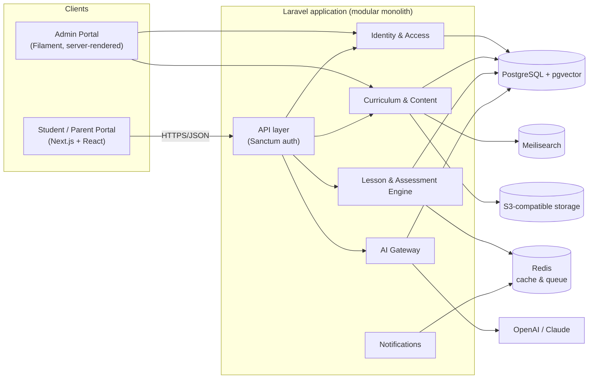

# Software Architecture

## Purpose

This book defines the system-level software architecture for Lumora Academy: how the platform is structured, how its parts fit together, and the principles that keep it modular and maintainable as it grows.

It does not duplicate detail owned by sibling books — see [Scope boundaries](#scope-boundaries) below.

## Status

Version: 1.1 foundation draft. Expands the Phase 0 skeleton with the first real architecture overview; module boundaries are a working draft, not yet ratified by ADR.

## Architecture style

Lumora Academy is built as a **modular monolith**, per [ADR-0001](../21-adr/0001-use-laravel-filament-postgresql.md) and the [Constitution](../00-constitution/index.md#non-negotiable-principles) (principle 9: architecture must remain modular; principle 10: minimize vendor lock-in).

- One Laravel application, organized into clearly bounded internal modules — not a shared "big ball of mud."
- No microservices at launch. Split a module into its own service only when scale, team boundaries, performance, or reliability justify it (ADR-0001).
- External integrations (AI providers, storage, search) sit behind abstraction layers so the underlying vendor can be swapped without touching the modules that use them.

## System overview

This is a conceptual diagram, not a deployment diagram — see [Infrastructure & DevOps](../13-infrastructure-devops/index.md) for hosting topology.

## Primary modules (working draft)

Derived from the [Roadmap](../25-roadmap/index.md) Phase 1 and Phase 2 scope. These are internal module boundaries inside the single Laravel application, not separate services.

| Module | Responsibility |
|---|---|
| Identity & Access | Authentication (Sanctum), roles and permissions, account/profile data |
| Curriculum & Content | Curriculum structure, lessons, question bank, content storage |
| Lesson & Assessment Engine | Delivering lessons, running assessments, scoring |
| AI Gateway | Single entry point to OpenAI/Claude; prompt library; safety guardrails; AI audit logging |
| Notifications | Email/in-app notifications; Reverb-backed realtime where needed |

Admin operations (Filament) and the student/parent portal (Next.js) are separate client applications, not modules — they consume the modules above only through the API layer.

!!! note "Not yet decided"
    Exact module folder structure, inter-module contracts, and whether Notifications needs its own module vs. living inside each feature module are open. Resolve these as Phase 1 work starts, and record the outcome as an ADR once settled.

## Cross-cutting principles

- **AI safety is architectural, not incidental.** All AI provider calls route through the AI Gateway so safety guardrails, prompt review, and audit logging (Constitution principle 3 & 4) apply uniformly — no module calls OpenAI/Claude directly. Detailed rules live in the [AI Development Bible](../06-ai-development-bible/index.md).
- **Privacy by design.** Identity & Access is the single owner of personal data; other modules reference it by ID rather than duplicating personal data. Detailed rules live in [Security & Privacy](../12-security-privacy/index.md).
- **Accessibility is a portal concern, not a backend one.** The API stays presentation-agnostic; accessibility requirements are enforced in the client layer — see [UI/UX Design System](../11-ui-ux-design-system/index.md).
- **Vendor lock-in stays minimized.** AI providers sit behind the AI Gateway, storage behind an S3-compatible interface, vector search behind pgvector (with Qdrant as a documented future option) — see [Technology Stack](technology-stack.md).

## Scope boundaries

This book covers system-level structure only. Detail lives in sibling books:

| Topic | Owned by |
|---|---|
| Database schema, migrations, indexing | [Database Architecture](../09-database-architecture/index.md) |
| API endpoints, request/response contracts, versioning | [API Architecture](../10-api-architecture/index.md) |
| Coding conventions, branching, review process | [Development Standards](../08-development-standards/index.md) |
| Auth/data security controls, threat model | [Security & Privacy](../12-security-privacy/index.md) |
| Deployment topology, environments, CI/CD | [Infrastructure & DevOps](../13-infrastructure-devops/index.md) |
| Test strategy and coverage expectations | [Testing & QA](../14-testing-qa/index.md) |

## Related documents

- [Technology Stack](technology-stack.md) — the concrete tools behind each layer above.
- [ADR-0001](../21-adr/0001-use-laravel-filament-postgresql.md) — why Laravel/Filament/PostgreSQL.
- [Roadmap](../25-roadmap/index.md) — the phase this architecture is built to support.
