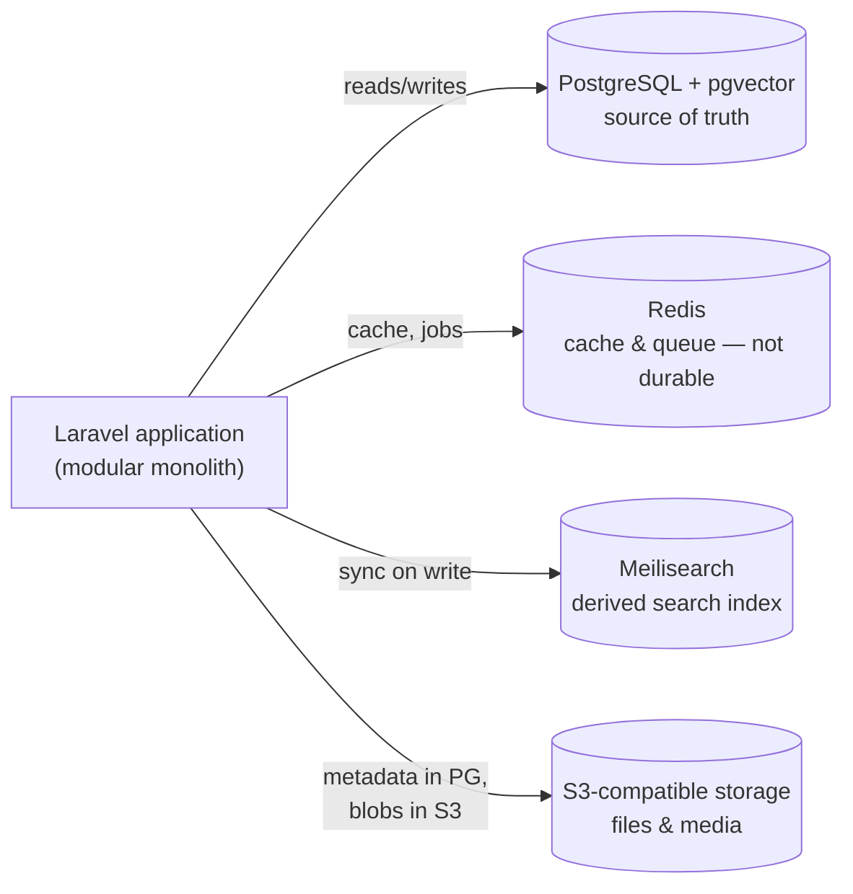

# Database Architecture

## Purpose

This book defines how Lumora Academy stores and owns data: which store holds what, how schema ownership maps to the modules in [Software Architecture](../07-software-architecture/index.md), and the principles that keep data trustworthy as the platform grows.

It does not define actual table schemas yet — see [Status](#status).

## Status

Version: 1.4 foundation draft. Establishes data-store roles and ownership principles ahead of Phase 1. No tables are designed yet; that starts once a module's feature work begins, and each schema should be reviewed against this book as it's built. Multi-tenancy, data classification, and retention policy now all have proposed ADRs.

## Data stores and their roles

Per [Technology Stack](../07-software-architecture/technology-stack.md) and [ADR-0001](../21-adr/0001-use-laravel-filament-postgresql.md):

- **PostgreSQL is the single source of truth.** One database backs the whole monolith — not one database per module. Modules are separated logically (see below), not by physical database, which keeps operations simple while the team is small (consistent with ADR-0001's "small team, fast to build" rationale).
- **pgvector holds embeddings**, used for Phase 2 RAG and AI-assisted content features. It lives in the same PostgreSQL instance as relational data. Move to a dedicated vector store (Qdrant) only if scale or query patterns justify it — this is an explicit, documented option, not a default (per Technology Stack).
- **Redis is disposable.** Cache and queue data only. Nothing is stored in Redis that isn't reconstructable from PostgreSQL — losing Redis should never lose data, only performance.
- **Meilisearch is a derived index, not authoritative.** It's kept in sync with PostgreSQL for full-text search; PostgreSQL rows are always the record of truth if the two disagree.
- **S3-compatible storage holds files, not metadata.** Uploaded media, generated assets, and large binary content live in object storage; PostgreSQL stores references (keys, URLs, checksums) and ownership metadata, not the blobs themselves.

## Schema ownership

Schema ownership follows the module map in [Software Architecture](../07-software-architecture/index.md#primary-modules-working-draft): each module owns its own tables, even though they share one physical database.

| Module | Owns |
|---|---|
| Identity & Access | Accounts, roles/permissions, profile data |
| Curriculum & Content | Curriculum structure, lessons, question bank, content metadata |
| Lesson & Assessment Engine | Assessment attempts, scores, progress records |
| AI Gateway | Prompt/response logs, AI audit trail, embeddings (pgvector) |
| Notifications | Notification records, delivery state |

**Rule:** a module's tables are only written to by that module's own code. Other modules reference its data by ID (typically a foreign key), never by reaching in and writing another module's tables directly. This is what keeps a modular monolith modular even though everything sits in one database — the boundary is enforced in application code and code review, not by separate databases. Conventions for enforcing this (e.g. via Laravel's model boundaries) belong in [Development Standards](../08-development-standards/index.md).

## Privacy and child safety in schema design

Directly from the [Constitution](../00-constitution/index.md#non-negotiable-principles) (principle 4: child safety is mandatory; principle 5: privacy is a product feature — minimal, purposeful, protected, explainable data collection):

- Collect the minimum personal data needed for each feature — don't add a column "in case it's useful later."
- Personal data belongs to Identity & Access; other modules reference a user by ID rather than copying personal fields (name, email, date of birth) into their own tables.
- Every table holding personal or child-related data is identifiable as such via a migration-comment convention — [ADR-0020](../21-adr/0020-four-tier-data-classification.md) proposes a four-tier scheme (Public/Internal/Personal/Sensitive-Child) so tables can be located for access, export, or deletion requests.
- Detailed retention, deletion, and compliance rules are owned by [Security & Privacy](../12-security-privacy/index.md), not this book — this book only ensures the schema is *shaped* to support them.

**Multi-tenancy:** [ADR-0017](../21-adr/0017-single-tenant-schema-defer-multi-tenancy.md) proposes staying single-tenant/shared-schema through Phase 1 and Phase 2, with the actual multi-tenancy pattern for Phase 3 "School edition" chosen then, informed by real requirements — not decided now.

**Retention:** [ADR-0029](../21-adr/0029-malaysia-pdpa-applicable-regulation.md) confirms Malaysia's PDPA as the applicable regulation and applies its purpose-based Retention Principle — data is kept while the associated account is active, then purged within a bounded window after deletion, rather than a fixed statutory period PDPA doesn't specify.

## Scope boundaries

| Topic | Owned by |
|---|---|
| System/module boundaries this schema ownership maps to | [Software Architecture](../07-software-architecture/index.md) |
| API request/response shapes (may differ from table shape) | [API Architecture](../10-api-architecture/index.md) |
| Migration conventions, naming, branching | [Development Standards](../08-development-standards/index.md) |
| Data protection, retention, compliance, threat model | [Security & Privacy](../12-security-privacy/index.md) |
| Backups, disaster recovery, environment topology | [Infrastructure & DevOps](../13-infrastructure-devops/index.md) |

## Related documents

- [Software Architecture](../07-software-architecture/index.md) — the module map this book's ownership rules follow.
- [Technology Stack](../07-software-architecture/technology-stack.md) — the concrete data stores in use.
- [ADR-0001](../21-adr/0001-use-laravel-filament-postgresql.md) — why PostgreSQL.
- [Roadmap](../25-roadmap/index.md) — the phase this data model is built to support.
